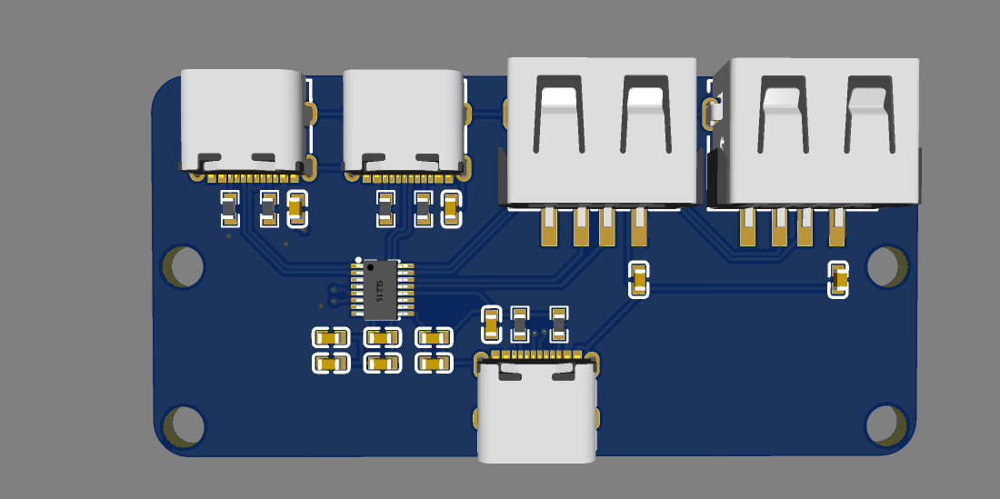
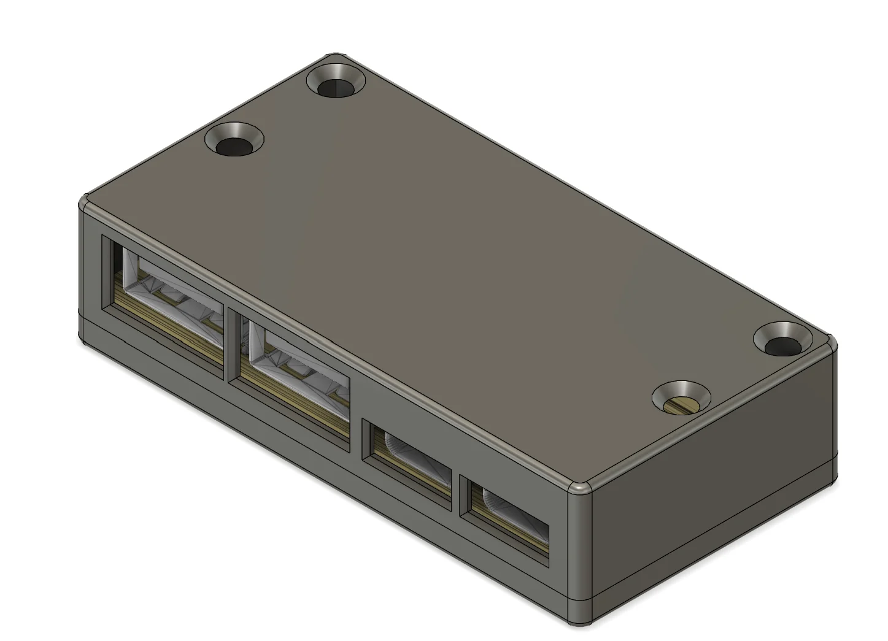

# USB Hub

A custom USB hub featuring **1× USB Type-C input**, **2× USB Type-C outputs**, and **2× USB Type-A outputs**. The project is built around the **CoreChips SL2.1S USB 2.0 Hub Controller** and includes a custom-designed PCB and 3D-printed enclosure.

---

## Features

- 1× USB Type-C upstream port
- 2× USB Type-C downstream ports
- 2× USB Type-A downstream ports
- USB 2.0 High-Speed hub
- Powered directly from the host device
- Custom PCB designed in EasyEDA
- Compact 3D-printed enclosure
- Mounting holes for secure installation

---

## Why I Made This

I wanted to learn more about USB hardware design, PCB layout, and enclosure design by creating my own USB hub from scratch. This project gave me experience with USB routing, component selection, PCB manufacturing, and mechanical design.

---

## Hardware

### Main Components

| Component | Part Number |
|-----------|-------------|
| USB Hub Controller | CoreChips SL2.1S |
| USB-C Connectors | SHOU HAN TYPE-C 16PIN 2MD(073) |
| USB-A Connectors | SHOU HAN 10.0 QHHTZB6.3 |
| Decoupling Capacitors | 1µF & 100nF 0603 |
| USB-C Configuration Resistors | 5.1kΩ |
| Pull-up Resistors | 56kΩ |

---

## Bill of Materials

| Part | Manufacturer | Quantity | LCSC Part |
|------|--------------|---------:|-----------|
| 1µF Capacitor (0603) | Samsung | 8 | C15849 |
| 100nF Capacitor (0603) | Yageo | 3 | C14663 |
| 5.1kΩ Resistor (0603) | UNI-ROYAL | 2 | C23186 |
| 56kΩ Resistor (0603) | UNI-ROYAL | 4 | C23206 |
| SL2.1S USB Hub Controller | CoreChips | 1 | C2684433 |
| USB Type-C Connector | SHOU HAN | 3 | C2765186 |
| USB Type-A Connector | SHOU HAN | 2 | C668591 |

The complete BOM, including pricing, is available in **bom.csv**.

---

## PCB

The PCB was designed in **EasyEDA** and includes:

- USB Type-C input connector
- Two USB Type-C output connectors
- Two USB Type-A output connectors
- CoreChips SL2.1S USB hub controller
- Power filtering capacitors
- USB-C configuration resistors
- Mounting holes
- Compact PCB layout

---

## Enclosure

A custom enclosure was designed to:

- Protect the electronics
- Provide access to every USB connector
- Secure the PCB with mounting holes
- Create a clean and professional appearance

---

## Assembly

1. Order the PCB.
2. Solder all SMD components.
3. Solder the USB connectors.
4. Inspect all solder joints.
5. Verify continuity and power connections.
6. Test the USB hub on a computer.
7. Install the PCB into the enclosure.
8. Secure the PCB with screws.
9. Close the enclosure.

---

---

## Images

### PCB Render

### 3D Enclosure

### Finished Device

> Add photos once assembled.

---

## Future Improvements

- USB 3.x support
- USB Power Delivery (PD)
- ESD protection
- Overcurrent protection
- Activity LEDs
- Smaller enclosure
- Optional external power input

---

## License

This project is licensed under the MIT License.
